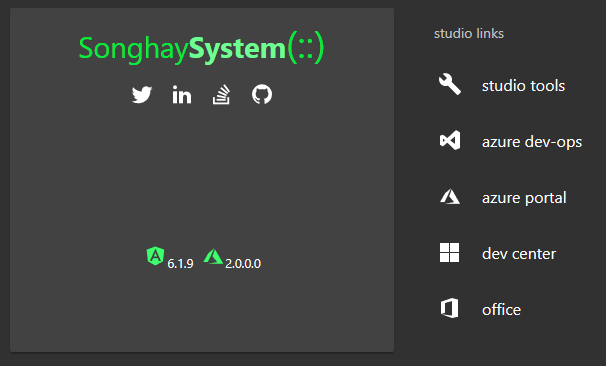

# Songhay.Dashboard

 [client build]

 [WebJob build]

This repo stores the code for my professional dashboard at [SonghaySystem.com](http://songhaysystem.com):

My intent around the “dashboard” concept is to roll up all of my online activities related to my professional identity in a single view. This utility is more useful to me than to others but it also serves as the current “state of the art” for my studio.

@[BryanWilhite](https://twitter.com/bryanwilhite)